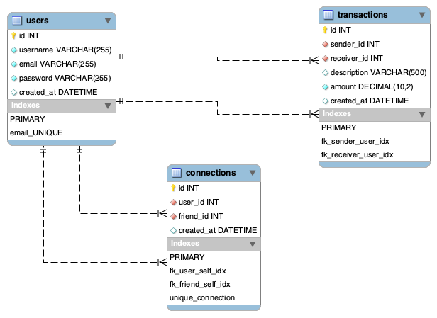

# Pay My Buddy – Prototype

This repository contains the database and application prototype for **Pay My Buddy**, developed using Java and MySQL.

## Contents

- 🧱 Physical Data Model (see below)
- 🧾 SQL scripts to create the schema
- ☕ Java DAL (Data Access Layer) with transaction handling
- 🔐 Secure DB connection
- 🌐 Web interface using DAL logic

---

## Physical Data Model (MPD)

The following diagram represents the physical data model for the Pay My Buddy prototype, based on the UML class diagram.

### MPD Diagram

### 🗃️ Tables and Attributes

#### `users`

| Column     | Type          | Constraints                  |
|------------|---------------|------------------------------|
| id         | INT           | PK, AUTO_INCREMENT           |
| username   | VARCHAR(255)  | NOT NULL                     |
| email      | VARCHAR(255)  | UNIQUE, NOT NULL             |
| password   | VARCHAR(255)  | NOT NULL                     |
| created_at | DATETIME      | DEFAULT CURRENT_TIMESTAMP    |

---

#### `transactions`

| Column       | Type           | Constraints                          |
|--------------|----------------|--------------------------------------|
| id           | INT            | PK, AUTO_INCREMENT                   |
| sender_id    | INT            | FK → users(id), NOT NULL             |
| receiver_id  | INT            | FK → users(id), NOT NULL             |
| description  | VARCHAR(500)   | NULL                                 |
| amount       | DECIMAL(10,2)  | NOT NULL                             |
| created_at   | DATETIME       | DEFAULT CURRENT_TIMESTAMP            |

---

#### `connections`

| Column      | Type      | Constraints                                |
|-------------|-----------|--------------------------------------------|
| id          | INT       | PK, AUTO_INCREMENT                         |
| user_id     | INT       | FK → users(id), NOT NULL                   |
| friend_id   | INT       | FK → users(id), NOT NULL                   |
| created_at  | DATETIME  | DEFAULT CURRENT_TIMESTAMP                  |
| UNIQUE(user_id, friend_id) – prevents duplicate friendships           |

---

## Relationships

- A user can send and receive many transactions.
- Users can connect to each other (many-to-many) via the `connections` table.
- All foreign keys are defined to ensure referential integrity.

